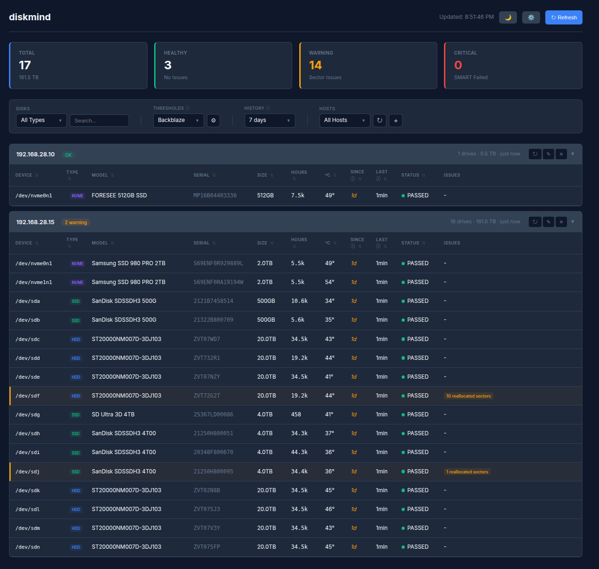

# diskmind

SMART disk health monitoring for Linux servers. Old issues don't spam you, new ones do.



## Quick Start

```bash
git clone https://github.com/efnats/diskmind.git
cd diskmind
./diskmind web --port 8080
```

Open `http://localhost:8080` → Add hosts via Dashboard → Done.

## What Makes It Different

- **Zero dependencies** · Python 3.8+ standard library only. No pip, no hassle.
- **SSH or Push** · Pull data via SSH, or let agents push through firewalls. Mix both.
- **Smart alerting** · Tracks changes over time. Old issues stay quiet, new ones trigger alerts.
- **Push notifications** · ntfy, Discord, Slack, Telegram, Gotify, Pushover, webhooks.
- **Trends at a glance** · Sparklines show attribute history. Spot degradation early.

## Two Ways to Collect Data

**SSH Mode** · Central server pulls data:
```bash
./diskmind fetch --hosts 192.168.1.10,192.168.1.11
```

**Push Mode** · Agents push data (for hosts behind NAT):
```bash
# On target host (via cron):
./bin/diskmind_scan --push http://server:8080 --host 192.168.1.10
```

Unknown hosts appear in the dashboard for approval.

## Project Structure

```
diskmind/
  diskmind          ← Start here (./diskmind web|fetch|scan)
  bin/              ← Python scripts
  templates/        ← Web dashboard
  config/           ← Settings (auto-created on first change)
```

## Configuration

Runs with sensible defaults. Edit `config/config.yaml` or use the web UI:

- **Hosts** · Add/remove via dashboard
- **Thresholds** · Relaxed, Conservative, Backblaze presets + custom editor
- **Notifications** · Severity, quiet periods, recovery alerts
- **Endpoints** · Add webhook URLs, auto-detects service type

## Documentation

- [Configuration Reference](docs/CONFIG.md)
- [Push Agent Setup](docs/PUSH.md)
- [Automation (Cron/Systemd)](docs/AUTOMATION.md)

## License

MIT
